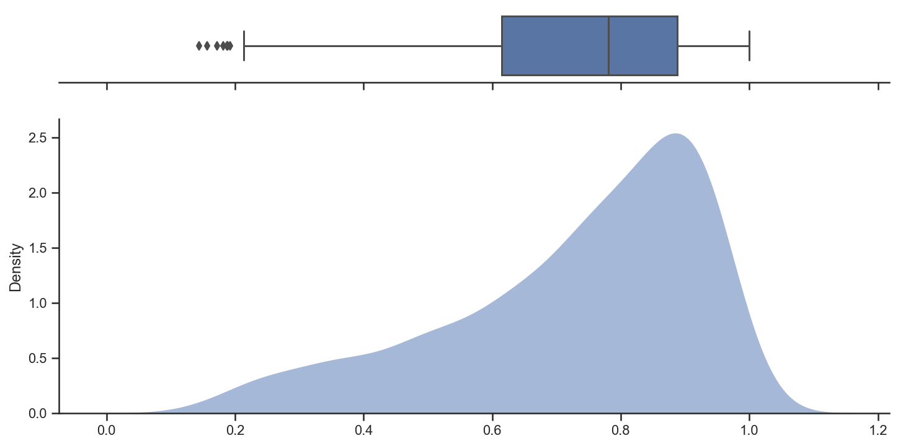

# Research on the quality of localization of movie titles

The aim of this study was to find out:

1) How similar are Russian titles and original titles in general?
2) Is it possible to split dissimilar pairs (`Russian title` :: `original title`) into groups according to the root cause?

**Results**:

In general, the titles are somewhat similar - the title similarity distribution is left-skewed.  
Average similarity is equal to 0.73 (median is 0.78)

Several causes of dissimilarity:  

1) **Russian title is a cropped version of original title**  
    Another problem in this case can be the fact that embeddings don't work very well with proper names like Borat :: Борат, Dolittle :: Дулиттл, and so on.

    Examples:

    * Борат (Borat) :: Borat: Cultural Learnings of America for Make Benefit Glorious Nation of Kazakhstan
    * Веном 2 (Venom 2) :: Venom: Let There Be Carnage
    * Бёрдмэн (Birdman) :: Birdman or (The Unexpected Virtue of Ignorance)
    * Амели (Amelie) :: Le Fabuleux destin d'Amélie Poulain

2) **Russian title is an extended version of original title**  
    Remark about proper names applies to this case too.  
    Examples:

    * Удивительное путешествие доктора Дулиттла (The Amazing Journey of Doctor Dolittle) :: Dolittle
    * Пол: Секретный материальчик (Paul: Secret material) :: Paul
    * Рапунцель: Запутанная история (Rapunzel: Tangled) :: Tangled

3) **Russian title was localized (made up) by translators/localizers**  
    Sometimes it is better to localize the title due to cultural and other peculiarities, but sometimes it goes too far.
    Examples:

    * Невероятный мир глазами Энцо (Incredible world through the eyes of Enzo) :: The Art of Racing in the Rain
    * Человек, который изменил всё (The man who changed everything) :: Moneyball
    * Области тьмы (Areas of darkness) :: Limitless
    * Одинокий волк (Lone wolf) :: Clean

Code to perform the research can be found here:

* [Notebook]()
* [Main functions]()
